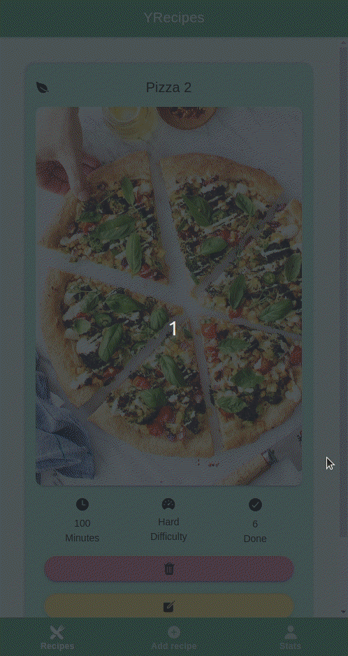

<!-- PROJECT LOGO -->
 

  

  <h3 align="center">YRecipes</h3>
  
The App for Saving Recipes

   
   

  

    <a href="https://github.com/othneildrew/Best-README-Template">View Demo</a>
    ·
    <a href="https://github.com/miguelcanosantana/YRecipes-App/issues">Report Bug</a>
  

 
 

## About The Project
This App is made in Ionic, it allows you to:
* Create and Edit Recipes.
* Set the time spent making them, the difficulty, if they are plant based.
* Track how much of them you did.
* Have a Chef Score to motivate you! :D.

## Usage of the App

### Add Recipe

 
  

### Count Recipe as Done

 
  

### See Recipe Text

 
  

### Edit Recipe

 
  

### See your Chef level

 
  

### Delete a Recipe

 
  

## That's All Folks!
