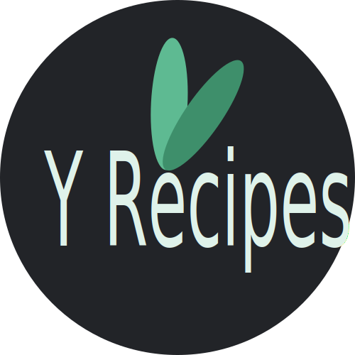

<!-- PROJECT LOGO -->
 

  

  <h3 align="center">YRecipes</h3>
  
The App for Saving Recipes

   
   

  

    <a href="https://github.com/othneildrew/Best-README-Template">View Demo</a>
    ·
    <a href="https://github.com/othneildrew/Best-README-Template/issues">Report Bug</a>
  

<!-- ABOUT THE App -->
## About The Project
This App is made in Ionic, it allows you to:
* Create and Edit Recipes.
* Set the time spent making them, the difficulty, if they are plant based.
* Track how much of them you did.
* Have a Chef Score to motivate you! :D.
